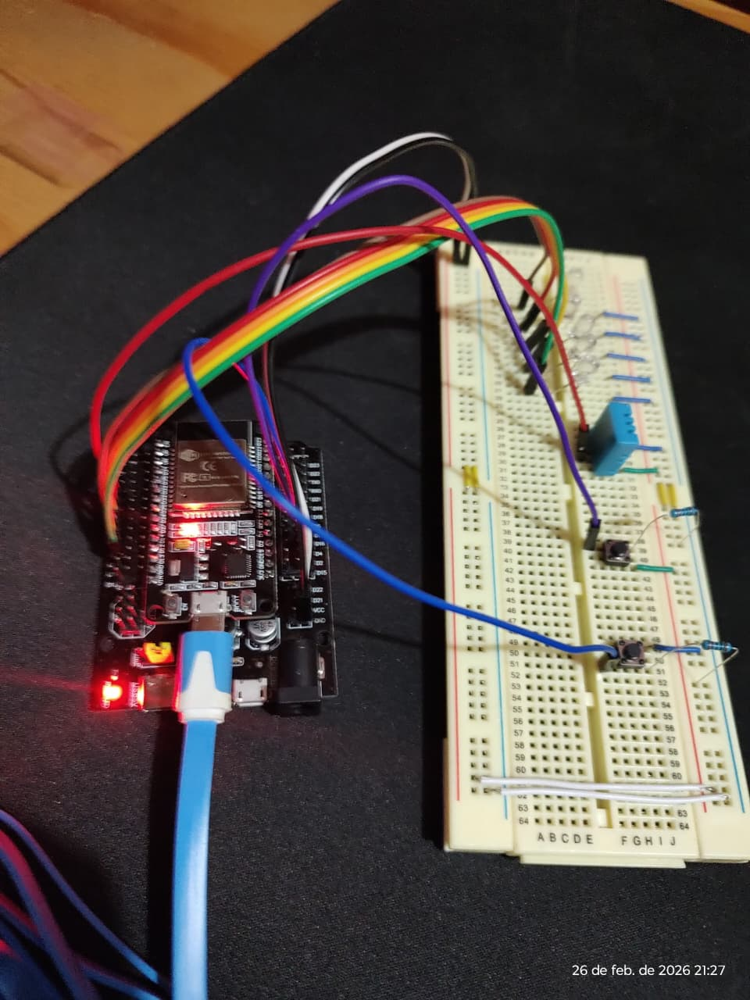
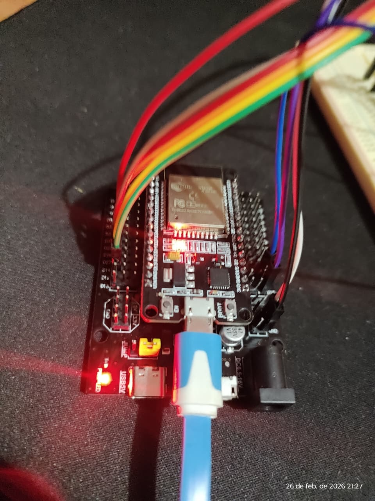
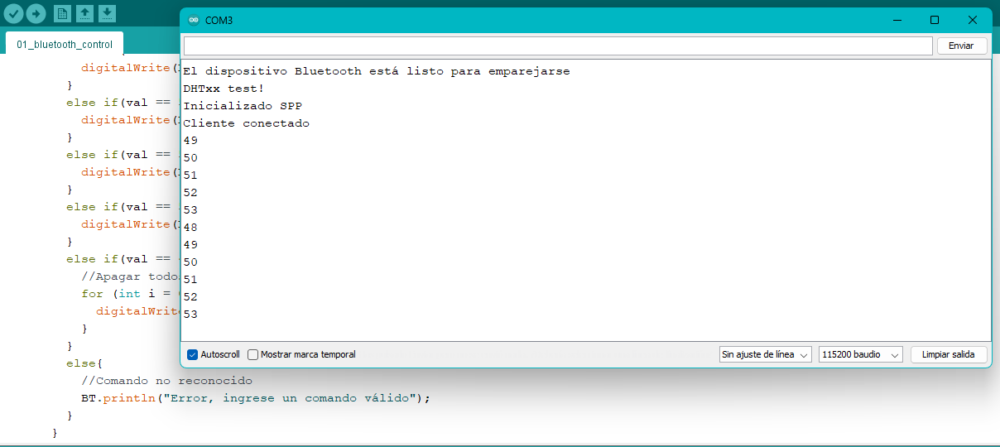
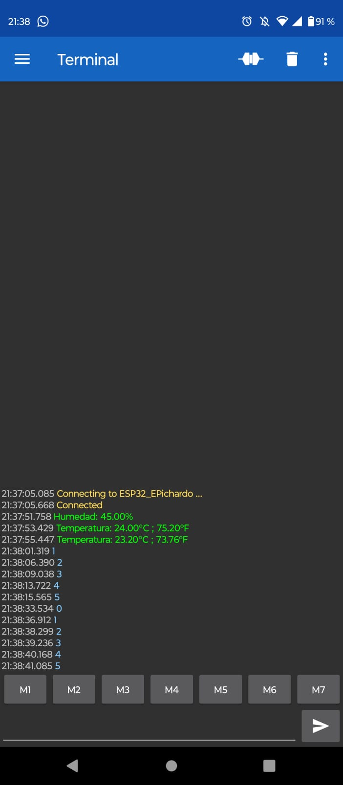
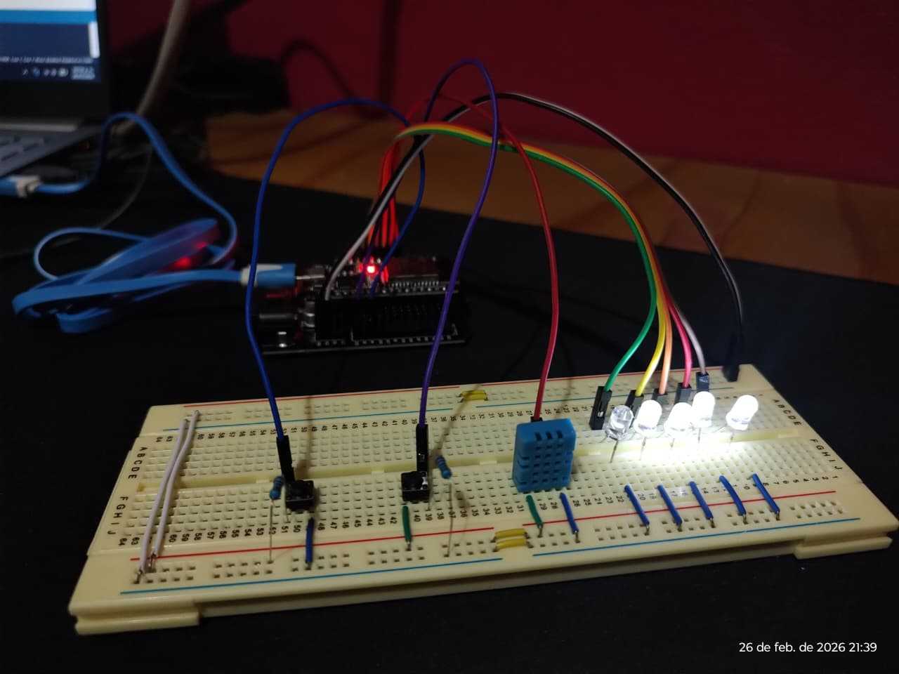

# Proyecto IoT: Control Bluetooth con ESP32 y Sensor DHT11

  

## Descripción General 

En esta práctica se implementa un sistema de control y monitoreo utilizando un **ESP32** que se comunica vía **Bluetooth** con un dispositivo externo (como un smartphone o computadora). 

El sistema permite:

- Encender y apagar 5 LEDs de forma individual o todos a la vez mediante comandos enviados por Bluetooth.
- Leer la temperatura y la humedad desde un sensor **DHT11** al presionar dos pulsadores físicos conectados al ESP32, y enviar los datos al dispositivo conectado por Bluetooth.

El código está desarrollado en el entorno de Arduino (compatible con PlatformIO) y hace uso de las librerías `BluetoothSerial` y `DHT` para manejar la comunicación y el sensor.

## Componentes Necesarios

| Componente               | Cantidad | Notas                                           |
|--------------------------|----------|-------------------------------------------------|
| ESP32 (cualquier modelo) | 1        | Se usa el puerto serie y Bluetooth              |
| Sensor DHT11             | 1        | Para medir temperatura y humedad                |
| LEDs (colores variados)  | 5        | Pueden ser de 5mm o 3mm                         |
| Resistencias de 220Ω     | 5        | Para limitar corriente en los LEDs              |
| Pulsadores (push buttons)| 2        | Uno con pull-down, otro con pull-up interno     |
| Resistor 10kΩ (para SW1) | 1        | Solo necesario si se usa pull-down externo      |
| Protoboard y cables      | -        | Para realizar las conexiones                    |

   
   
    
   <em>Figura: Montaje físico del programa</em>

## Diagrama de Conexiones

A continuación se describen las conexiones físicas entre los componentes y el ESP32:

| Componente      | Pin del ESP32 | Notas                                                          |
|-----------------|---------------|----------------------------------------------------------------|
| LED1            | GPIO 14       | Ánodo al pin, cátodo a GND (con resistencia de 220Ω)          |
| LED2            | GPIO 27       | Igual que LED1                                                 |
| LED3            | GPIO 26       | Igual que LED1                                                 |
| LED4            | GPIO 25       | Igual que LED1                                                 |
| LED5            | GPIO 33       | Igual que LED1                                                 |
| Pulsador SW1    | GPIO 15       | Conectar entre el pin y VCC (3.3V) con resistencia pull-down de 10kΩ a GND |
| Pulsador SW2    | GPIO 4        | Conectar entre el pin y GND (usando resistencia pull-up interna del ESP32) |
| Sensor DHT11    | GPIO 32       | VCC a 3.3V, GND a GND, Data al pin 32                          |

**Nota:** Para SW2 se utiliza la resistencia pull-up interna del ESP32, por lo que no se requiere resistor externo; el pin se conecta directamente a GND cuando se presiona.

## Configuración del Entorno

### Arduino IDE

1. Instala el soporte para ESP32 en el Arduino IDE siguiendo la [guía oficial](https://github.com/espressif/arduino-esp32).
2. Instala las librerías necesarias:
   - **BluetoothSerial** (viene incluida con el paquete de ESP32).
   - **DHT sensor library** de Adafruit (búscala en el Gestor de Librerías).
3. Selecciona la placa **ESP32 Dev Module** y el puerto COM correspondiente.
4. Copia el código proporcionado y súbelo a tu ESP32.

## Explicación del Código

El código está organizado en varias secciones:

1. Inclusión de librerías y definiciones de pines: Se definen los pines para LEDs, pulsadores y el sensor DHT, así como un array con los LEDs para facilitar el control.

2. Configuración de Bluetooth: Se crea un objeto BluetoothSerial con el nombre "ESP32_EPichardo". Se registra una función callback_function que maneja los eventos de conexión y los datos recibidos.

3. Manejo de comandos por Bluetooth:

- Cuando se recibe un byte, se interpreta su valor ASCII.

- Si es '1' (ASCII 49) se enciende LED1, '2' para LED2, etc.

- Si es '0' (ASCII 48) se apagan todos los LEDs.

- Cualquier otro carácter envía un mensaje de error.

4. Lectura de sensores con pulsadores:

- En el loop() se monitorean los dos botones.

- Al presionar SW1 se lee la temperatura en grados Celsius y Fahrenheit y se envía por Bluetooth.

- Al presionar SW2 se lee la humedad y se envía por Bluetooth.

- Se utiliza un anti-rebote simple con millis() para evitar múltiples lecturas.

- Función callback: Se encarga de imprimir en el monitor serie los eventos de Bluetooth y de procesar los datos entrantes.

   
    
   <em>Figura: Respuestas del monitor serie del IDe de Arduino</em>

## Instrucciones de Uso

- Alimenta el ESP32 (por USB o fuente externa).

- Abre el monitor serie (115200 baudios) para ver mensajes de depuración.

- Empareja tu dispositivo (smartphone, PC) con el Bluetooth llamado "Nombre_dispositivo".

- Usa una aplicación de terminal Bluetooth (por ejemplo, "Serial Bluetooth Terminal" en Android) para conectarte al ESP32.

- Envía comandos:

1 -> Enciende LED1

2 -> Enciende LED2

3 -> Enciende LED3

4 -> Enciende LED4

5 -> Enciende LED5

0 -> Apaga todos los LEDs

- Presiona los botones físicos:

- - SW1: Envía la temperatura actual (°C y °F).

- - SW2: Envía la humedad actual (%).

Verás las lecturas en la terminal Bluetooth.

   
   
    
   <em>Figura: Funcionamiento del sistema</em>

## Posibles Mejoras

- Implementar un sistema de autenticación para evitar conexiones no deseadas.

- Añadir control de brillo PWM para los LEDs.

- Integrar con un broker MQTT para convertir el proyecto en IoT completo.

- Usar una aplicación móvil personalizada con botones gráficos.

- Almacenar lecturas en una tarjeta SD o enviarlas a la nube.

## Autor

Nombre: Pichardo Rico Cristian Eduardo

## Licencia
Este proyecto está bajo la licencia MIT. Puedes ver el archivo LICENSE para más detalles.
