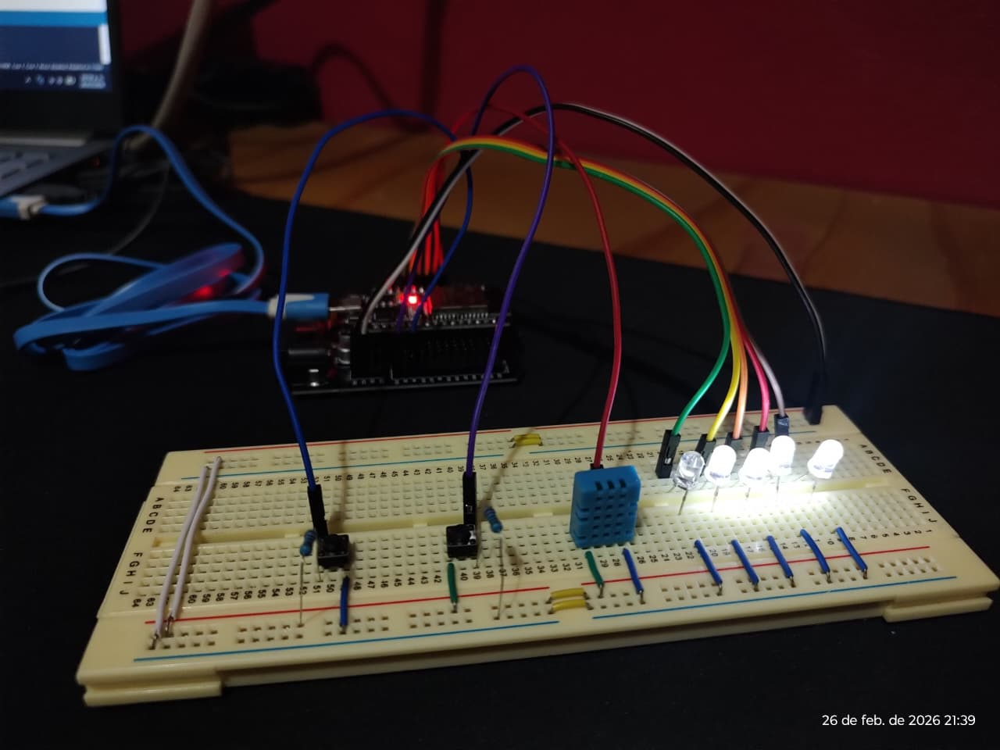
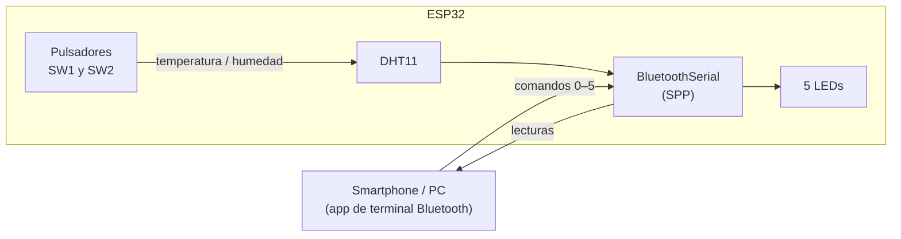
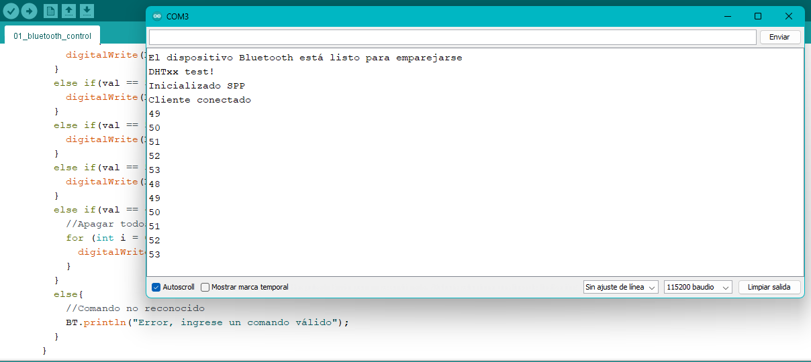
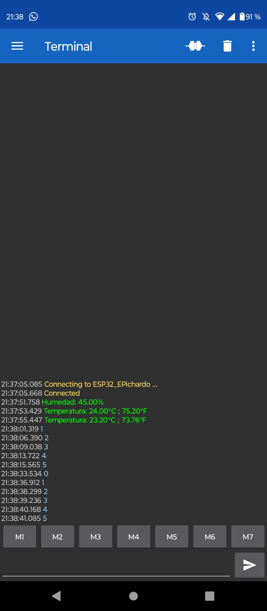

<div align="center">

# Proyecto 1: Control por Bluetooth con ESP32 y Sensor DHT11


Sistema de control y monitoreo en el que un **ESP32** se comunica por **Bluetooth clásico (perfil SPP)** con un smartphone o computadora. Desde una aplicación de terminal Bluetooth se controlan cinco LEDs, y al presionar dos pulsadores físicos el ESP32 envía de vuelta la temperatura y la humedad medidas por un sensor DHT11. La comunicación es **bidireccional y en tiempo real**.

</div>

<p align="center">
   
</p>

[← Volver al índice de proyectos](../../README.md)

---

## Qué hace

- **Enciende** cada uno de los 5 LEDs por separado con los comandos `1` a `5`, y **apaga todos** a la vez con `0`.
- **Envía la temperatura** (°C y °F) por Bluetooth al presionar el pulsador SW1.
- **Envía la humedad relativa** por Bluetooth al presionar el pulsador SW2.
- Responde con un mensaje de error si recibe un comando no válido o si el sensor no logra leer.
- Aplica un **antirrebote por software** (250 ms) a los pulsadores.

## Cómo funciona


```mermaid
flowchart LR
    PHONE["Smartphone / PC<br/>(app de terminal Bluetooth)"]
    subgraph ESP32
        BT["BluetoothSerial<br/>(SPP)"]
        LEDS["5 LEDs"]
        DHT["DHT11"]
        SW["Pulsadores<br/>SW1 y SW2"]
    end

    PHONE -- "comandos 0–5" --> BT
    BT --> LEDS
    SW -- "temperatura / humedad" --> DHT
    DHT --> BT
    BT -- "lecturas" --> PHONE
```

## Comandos y respuestas

| Entrada | Acción |
|:-:|---|
| `1` – `5` (Bluetooth) | Enciende el LED 1 al 5 |
| `0` (Bluetooth) | Apaga todos los LEDs |
| Otro carácter | El ESP32 responde `Error, ingrese un comando válido` |
| Pulsador **SW1** | Envía `Temperatura: <valor>°C ; <valor>°F` |
| Pulsador **SW2** | Envía `Humedad: <valor>%` |

## Componentes necesarios

| Componente | Cantidad | Notas |
|---|:-:|---|
| ESP32 (con Bluetooth clásico) | 1 | Se usan el puerto serie y el Bluetooth |
| Sensor DHT11 | 1 | Temperatura y humedad |
| LEDs (colores variados) | 5 | De 5 mm o 3 mm |
| Resistencias de 220 Ω | 5 | Limitan la corriente de los LEDs |
| Pulsadores | 2 | Uno con pull-down externo y otro con pull-up interno |
| Resistor de 10 kΩ | 1 | Solo para el pull-down externo de SW1 |
| Protoboard y cables | — | Para las conexiones |

## Diagrama de conexiones

Usa también el [mapa de pines compartido](../../media/PinMapEsp32IoT.jpg) del repositorio.

| Componente | Pin del ESP32 | Notas |
|---|:-:|---|
| LED 1 | GPIO 14 | Ánodo al pin, cátodo a GND (con resistencia de 220 Ω) |
| LED 2 | GPIO 27 | Igual que LED 1 |
| LED 3 | GPIO 26 | Igual que LED 1 |
| LED 4 | GPIO 25 | Igual que LED 1 |
| LED 5 | GPIO 33 | Igual que LED 1 |
| Pulsador SW1 | GPIO 15 | Entre el pin y 3.3 V, con resistencia pull-down de 10 kΩ a GND (activo en alto) |
| Pulsador SW2 | GPIO 4 | Entre el pin y GND, con la resistencia pull-up interna del ESP32 (activo en bajo) |
| Sensor DHT11 | GPIO 32 | VCC a 3.3 V, GND a GND, Data al pin |

## Cómo probarlo

**1. Prepara el entorno.**

- Instala el soporte para ESP32 en el Arduino IDE siguiendo la [guía oficial](https://github.com/espressif/arduino-esp32).
- Instala la librería **DHT sensor library** de Adafruit (y **Adafruit Unified Sensor**) desde el Gestor de bibliotecas. `BluetoothSerial` ya viene incluida con el paquete de ESP32.
- Selecciona la placa **ESP32 Dev Module** y el puerto correspondiente.

> `BluetoothSerial` usa Bluetooth clásico, por lo que requiere el ESP32 original: los modelos S2, S3 y C3 no lo incluyen.

**2. Elige el nombre Bluetooth.** En el sketch, cambia el nombre con el que aparecerá tu dispositivo:

```cpp
BT.begin("Nombre_dispositivo");
```

**3. Carga el sketch** y abre el Monitor Serie a **115200 baudios** para ver los mensajes de depuración.

<p align="center">
   
   <br>
   <em>Figura: Mensajes del monitor serie del Arduino IDE</em>
</p>

**4. Empareja tu dispositivo** (smartphone o PC) con el Bluetooth del ESP32 y conéctate con una app de terminal Bluetooth, por ejemplo *Serial Bluetooth Terminal* en Android.

**5. Interactúa.** Envía `1` a `5` para encender LEDs, `0` para apagarlos todos, y presiona SW1 o SW2 para recibir las lecturas del sensor en la terminal.

<p align="center">
   
   <br>
   <em>Figura: Comunicación desde la terminal Bluetooth</em>
</p>

## Explicación del código

1. **Librerías y pines:** se definen los pines de LEDs, pulsadores y DHT, junto con un arreglo con los LEDs para manejarlos en bucles.
2. **Bluetooth:** se crea un objeto `BluetoothSerial` y se registra una función *callback* que atiende los eventos de conexión, desconexión y datos recibidos.
3. **Comandos:** cada byte recibido se interpreta por su valor ASCII (`'1'` = 49 … `'5'` = 53 encienden LEDs; `'0'` = 48 los apaga todos). Los saltos de línea se ignoran.
4. **Lectura con pulsadores:** en `loop()` se vigilan SW1 y SW2; al presionarlos se lee el DHT11 y se envía el dato por Bluetooth. El antirrebote usa `millis()`.

## Limitaciones y mejoras posibles

- **Apagado individual:** hoy solo se puede encender cada LED por separado; añadir comandos de apagado o de alternancia (*toggle*) daría control completo.
- **Sin autenticación:** cualquier dispositivo que se empareje puede controlar el sistema. Se puede agregar un PIN de emparejamiento.
- **Control de brillo:** incorporar PWM para atenuar los LEDs.
- **Integración con MQTT:** conectar el sistema a un broker, como se hace en el [proyecto 3](../03_comunicacion_mqtt/).
- **Registro de datos:** guardar las lecturas en una tarjeta SD o enviarlas a la nube.
- **App personalizada:** sustituir la terminal genérica por una aplicación móvil con botones gráficos.

## Autor

**Cristian Eduardo Pichardo Rico**

Egresado de la Licenciatura en Física, Facultad de Ciencias, UNAM
GitHub: [@Edvard-Pichardo](https://github.com/Edvard-Pichardo)

Distribuido bajo la licencia **MIT**. Consulta el archivo [LICENSE](../../LICENSE).
