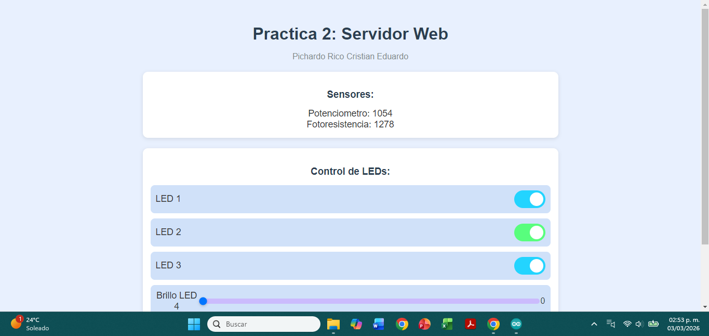

# Proyecto IoT 2: Servidor Web con ESP32 – Control y Monitoreo en Tiempo Real

   

## Descripción General

Este es el segundo proyecto de una serie dedicada al Internet de las Cosas (IoT). En esta práctica se implementa un **servidor web local** en el ESP32 que permite a los usuarios interactuar con el hardware a través de una interfaz gráfica accesible desde cualquier navegador en la misma red WiFi.

   
    
   <em>Figura: Servidor web local</em>

El sistema permite:

- **Monitorear** en tiempo real los valores de un potenciómetro y una fotoresistencia (sensores analógicos) mediante actualizaciones automáticas cada segundo.
- **Controlar** el encendido/apagado de tres LEDs (LED1, LED2, LED3) mediante interruptores tipo switch en la interfaz web.
- **Ajustar** el brillo de dos LEDs (LED4 y LED5) mediante controles deslizantes (PWM), con valores de 0 a 255.

La comunicación entre el cliente (navegador) y el servidor (ESP32) se realiza mediante peticiones **AJAX**, lo que permite actualizar los datos y enviar comandos sin necesidad de recargar la página. Los archivos de la interfaz web (HTML, CSS, JavaScript) se almacenan en el sistema de archivos **SPIFFS** del ESP32, facilitando su organización y modificación.

## Componentes Necesarios

| Componente               | Cantidad | Notas                                           |
|--------------------------|----------|-------------------------------------------------|
| ESP32 (cualquier modelo) | 1        | Se usa como servidor web                        |
| Potenciómetro            | 1        | Valor recomendado: 10kΩ                         |
| Fotoresistencia (LDR)    | 1        | Por ejemplo, GL5528                             |
| LEDs (colores variados)  | 5        | Pueden ser de 5mm o 3mm                         |
| Resistencias de 220Ω     | 5        | Para limitar corriente en los LEDs              |
| Resistor de 10kΩ         | 1        | Para la fotoresistencia (divisor de tensión)    |
| Protoboard y cables      | -        | Para realizar las conexiones                     |

## Diagrama de Conexiones

A continuación se describen las conexiones físicas entre los componentes y el ESP32:

| Componente          | Pin del ESP32 | Notas                                                          |
|---------------------|---------------|----------------------------------------------------------------|
| LED1                | GPIO 14       | Ánodo al pin, cátodo a GND (con resistencia de 220Ω)          |
| LED2                | GPIO 27       | Igual que LED1                                                 |
| LED3                | GPIO 26       | Igual que LED1                                                 |
| LED4                | GPIO 25       | Igual que LED1 (salida PWM)                                    |
| LED5                | GPIO 33       | Igual que LED1 (salida PWM)                                    |
| Potenciómetro       | GPIO 35       | Pin central al ADC, extremos a 3.3V y GND                      |
| Fotoresistencia     | GPIO 34       | Conectar en serie con una resistencia de 10kΩ a GND; el punto medio al pin ADC; el otro extremo a 3.3V |

**Nota:** La fotoresistencia forma un divisor de tensión con la resistencia de 10kΩ. La tensión en el pin ADC varía con la luz incidente.

## Configuración del Entorno

### Arduino IDE

1. Instala el soporte para ESP32 en el Arduino IDE siguiendo la [guía oficial](https://github.com/espressif/arduino-esp32).
2. Instala las librerías necesarias (puedes usar el Gestor de Librerías):
   - **ESPAsyncWebServer** (de me-no-dev)
   - **AsyncTCP** (de me-no-dev)
3. Instala el plugin para subir archivos a SPIFFS:
   - Descarga el plugin **ESP32FS** desde [aquí](https://github.com/me-no-dev/arduino-esp32fs-plugin/releases/).
   - Descomprímelo en la carpeta `tools` de tu directorio de Arduino (por ejemplo, `C:\Program Files (x86)\Arduino\tools`).
   - Reinicia el IDE. Verás una nueva opción en el menú "Herramientas": **ESP32 Sketch Data Upload**.
4. Prepara los archivos web:
   - Crea una carpeta llamada `data` dentro de la carpeta de tu sketch.
   - Coloca dentro los archivos `index.html`, `style.css` y `script.js`.
5. Sube los archivos a SPIFFS:
   - Conecta tu ESP32.
   - En el menú "Herramientas", selecciona el puerto correcto.
   - Haz clic en **Herramientas > ESP32 Sketch Data Upload**. Esto subirá los archivos a la memoria flash del ESP32.
6. Abre el código principal (el archivo `.ino`), ajusta las credenciales WiFi y súbelo a la placa.

## Explicación del Código

### Código principal (Arduino)

El código del ESP32 se encarga de:

- Conectar a la red WiFi y mostrar la dirección IP asignada.
- Inicializar el sistema de archivos SPIFFS y cargar los archivos web.
- Configurar el servidor asíncrono en el puerto 80.
- Definir rutas (endpoints) para servir la página principal, los archivos estáticos, y para recibir peticiones de actualización de LEDs y sliders.
- Leer los valores analógicos del potenciómetro y la fotoresistencia cuando se solicita.

### Rutas principales:

Ruta (método): Descripción

- `/` (GET): Sirve el archivo index.html procesando placeholders.
- `/style.css` (GET): Sirve el archivo CSS.
- `/script.js` (GET): Sirve el archivo JavaScript.
- `/sensorData` (GET): Devuelve los valores de los sensores en formato CSV (dos números separados por coma).
- `/update` (GET): Recibe parámetros "output" y "state" para encender/apagar los LEDs 1, 2 y 3.
- `/slider` (GET): Recibe el valor (0-255) para el LED4 y ajusta el PWM.
- `/slider2` (GET): Recibe el valor (0-255) para el LED5 y ajusta el PWM.

`Función processor`: Reemplaza los placeholders en el HTML (como %BUTTONPLACEHOLDER% y %SLIDERVALUE%) con el estado actual de los LEDs y el valor del slider. Esto permite que la página se cargue mostrando el estado correcto de los interruptores y el valor del slider.

`PWM`: Se utilizan dos canales PWM independientes: canal 0 para LED4 y canal 1 para LED5. Ambos configurados con frecuencia de 1 kHz y resolución de 8 bits, permitiendo valores de 0 a 255.

### Archivos Web

- **index.html**: Estructura de la página, dividida en secciones de sensores y controles. Incluye referencias a los archivos CSS y JavaScript. Los elementos tienen identificadores (id) que son utilizados por el JavaScript para actualizarlos.
- **style.css**: Define la apariencia visual. Incluye estilos para el cuerpo, encabezados, secciones, interruptores tipo switch (con colores diferentes para LED2) y los sliders personalizados (con thumb morado y efectos hover).
- **script.js**: Contiene la lógica del lado del cliente:
  - `toggleCheckbox(element)`: Se ejecuta al cambiar un interruptor. Crea una petición AJAX a /update con el id del elemento y el estado (1 u 0).
  - `setInterval`: Cada 1000 ms (1 segundo) realiza una petición AJAX a /sensorData, procesa la respuesta (divide por coma) y actualiza los elementos span con los nuevos valores del potenciómetro y la fotoresistencia
  - `updateSliderPWM(element)`: Se llama al cambiar el slider del LED4. Actualiza el texto del span con el valor actual y envía una petición AJAX a /slider con el valor.
  - `updateSliderPWM2(element)`: Similar para el LED5, pero enviando a /slider2.

## Instrucciones de Uso

1. Arma el circuito según el diagrama de conexiones.

2. Configura las credenciales WiFi en el código (ssid y password).

3. Sube los archivos web a SPIFFS usando el método correspondiente (Arduino IDE o PlatformIO).

4. Carga el programa principal al ESP32.

5. Abre el monitor serie para ver la dirección IP asignada al ESP32 (por ejemplo, 192.168.1.100).

6. Conecta tu dispositivo (ordenador, tablet, móvil) a la misma red WiFi.

7. Abre un navegador web y escribe la dirección IP del ESP32.

8. Interactúa con la interfaz:

  - Los valores del potenciómetro y la fotoresistencia se actualizan automáticamente.
  - Usa los interruptores para encender/apagar LED1, LED2 y LED3.
  - Mueve los deslizadores para ajustar el brillo de LED4 y LED5.

9. Observa los mensajes de depuración en el monitor serie para verificar la recepción de comandos.

## Posibles Mejoras

- Añadir autenticación mediante usuario y contraseña.
- Implementar un gráfico en tiempo real de los valores de los sensores (por ejemplo, con Chart.js).
- Incluir más sensores (temperatura, humedad, etc.) y mostrarlos en la interfaz.
- Agregar la posibilidad de guardar configuraciones (valores de PWM) en la EEPROM.
- Extender el sistema a Internet mediante un túnel (ngrok) o servicios en la nube (MQTT, Blynk).
- Mejorar el diseño responsive para dispositivos móviles.

## Autor

Nombre: Pichardo Rico Cristian Eduardo

## Licencia

Este proyecto está bajo la licencia MIT. Puedes ver el archivo LICENSE para más detalles.
