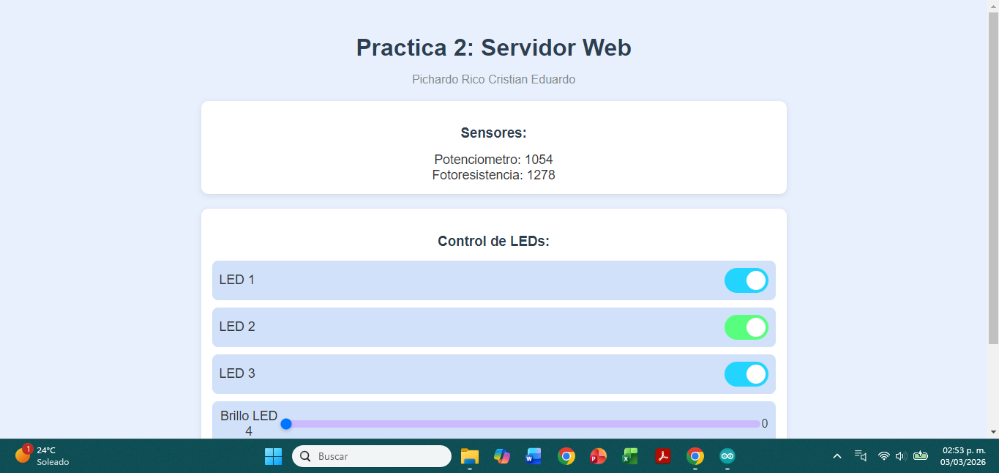
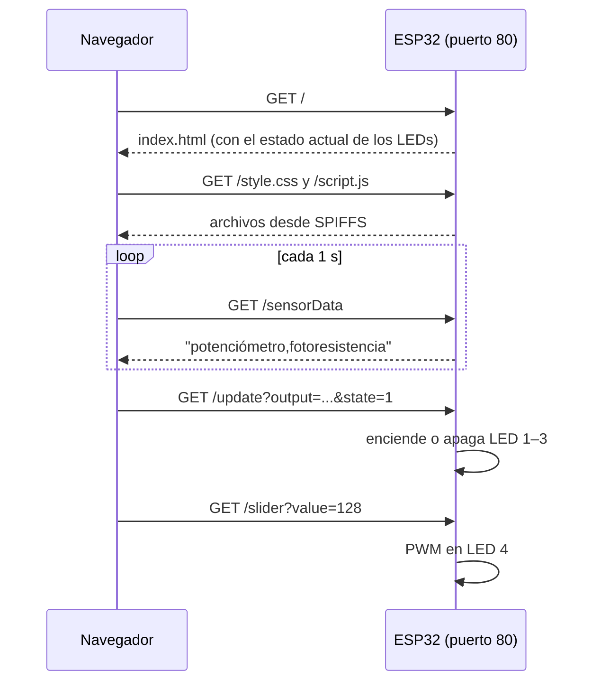
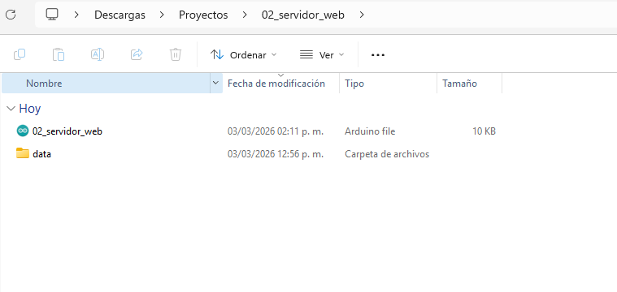
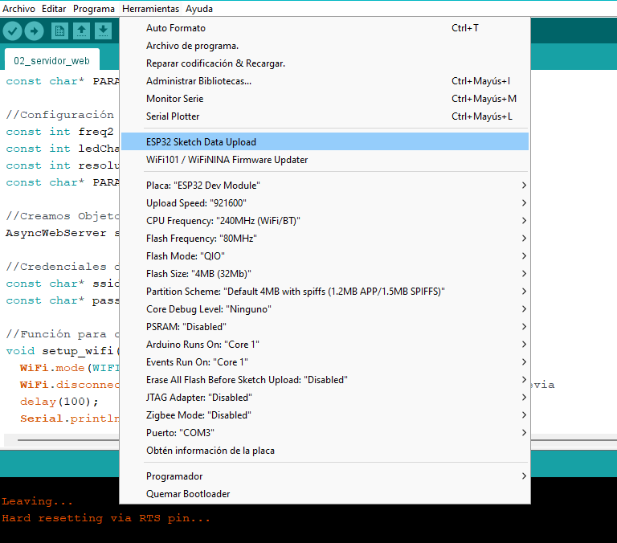
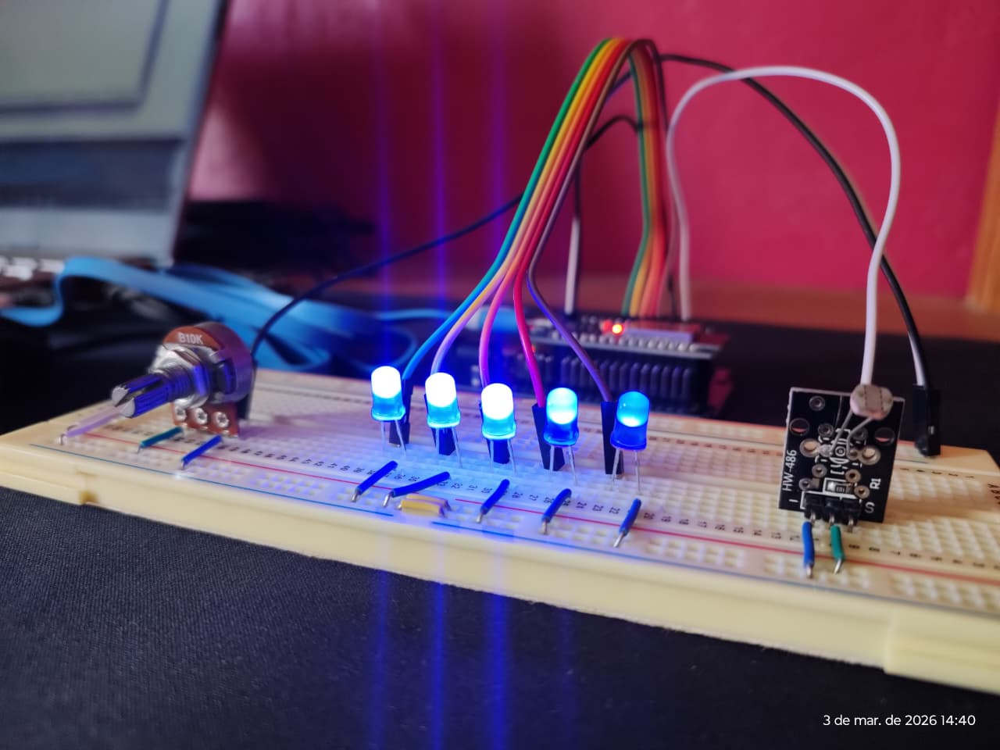

<div align="center">
   
# Proyecto 2: Servidor Web con ESP32, Control y Monitoreo en Tiempo Real


Un **servidor web local** alojado en el ESP32 que permite interactuar con el hardware desde una interfaz gráfica accesible en cualquier navegador conectado a la misma red WiFi. La página muestra sensores en tiempo real y controla cinco LEDs, sin necesidad de recargarse. Es la base de aplicaciones de domótica y monitoreo remoto.

</div>

<p align="center">
   
   <br>
   <em>Figura: Interfaz del servidor web local</em>
</p>

[← Volver al índice de proyectos](../../README.md)

---

## Qué hace

- **Monitorea** un potenciómetro y una fotoresistencia con actualización automática cada segundo.
- **Enciende y apaga** tres LEDs (LED 1, 2 y 3) con interruptores tipo *switch*.
- **Ajusta el brillo** de dos LEDs (LED 4 y 5) con deslizadores (PWM de 0 a 255).
- Actualiza datos y envía comandos mediante peticiones **AJAX**, sin recargar la página.
- Sirve la interfaz (HTML, CSS y JavaScript) desde el sistema de archivos **SPIFFS** del ESP32, lo que facilita modificarla sin tocar el firmware.

## Cómo funciona


```mermaid
sequenceDiagram
    participant N as Navegador
    participant E as ESP32 (puerto 80)

    N->>E: GET /
    E-->>N: index.html (con el estado actual de los LEDs)
    N->>E: GET /style.css y /script.js
    E-->>N: archivos desde SPIFFS

    loop cada 1 s
        N->>E: GET /sensorData
        E-->>N: "potenciómetro,fotoresistencia"
    end

    N->>E: GET /update?output=...&state=1
    E->>E: enciende o apaga LED 1–3
    N->>E: GET /slider?value=128
    E->>E: PWM en LED 4
```

### Rutas del servidor

| Ruta (método) | Descripción |
|---|---|
| `/` (GET) | Sirve `index.html` procesando los *placeholders* |
| `/style.css` (GET) | Sirve la hoja de estilos |
| `/script.js` (GET) | Sirve el JavaScript del cliente |
| `/sensorData` (GET) | Devuelve los dos valores de los sensores en CSV (dos números separados por coma) |
| `/update` (GET) | Recibe `output` y `state` para encender o apagar los LEDs 1, 2 y 3 |
| `/slider` (GET) | Recibe un valor de 0 a 255 y ajusta el PWM del LED 4 |
| `/slider2` (GET) | Recibe un valor de 0 a 255 y ajusta el PWM del LED 5 |

## Componentes necesarios

| Componente | Cantidad | Notas |
|---|:-:|---|
| ESP32 | 1 | Actúa como servidor web |
| Potenciómetro | 1 | Valor recomendado: 10 kΩ |
| Fotoresistencia (LDR) | 1 | Por ejemplo, GL5528 |
| LEDs (colores variados) | 5 | De 5 mm o 3 mm |
| Resistencias de 220 Ω | 5 | Limitan la corriente de los LEDs |
| Resistor de 10 kΩ | 1 | Divisor de tensión de la fotoresistencia |
| Protoboard y cables | — | Para las conexiones |

## Diagrama de conexiones

Usa también el [mapa de pines compartido](../../media/PinMapEsp32IoT.jpg) del repositorio.

| Componente | Pin del ESP32 | Notas |
|---|:-:|---|
| LED 1 | GPIO 14 | Ánodo al pin, cátodo a GND (con resistencia de 220 Ω) |
| LED 2 | GPIO 27 | Igual que LED 1 |
| LED 3 | GPIO 26 | Igual que LED 1 |
| LED 4 | GPIO 25 | Igual que LED 1 (salida PWM) |
| LED 5 | GPIO 33 | Igual que LED 1 (salida PWM) |
| Potenciómetro | GPIO 35 | Pin central al ADC; extremos a 3.3 V y GND |
| Fotoresistencia | GPIO 34 | En serie con una resistencia de 10 kΩ a GND; el punto medio al pin ADC y el otro extremo a 3.3 V |

> La fotoresistencia forma un **divisor de tensión** con la resistencia de 10 kΩ: el voltaje en el pin ADC cambia con la luz incidente.


## Cómo probarlo

### 1. Prepara el entorno

- Instala el soporte para ESP32 en el Arduino IDE siguiendo la [guía oficial](https://github.com/espressif/arduino-esp32). El sketch usa `ledcAttachChannel`, por lo que necesita la versión **3.x** del paquete.
- Instala las librerías **ESPAsyncWebServer** y **AsyncTCP** (ambas de me-no-dev).
- Instala el plugin para subir archivos a SPIFFS (instrucciones para Arduino IDE 1.x):
  1. Descarga **ESP32FS** desde [sus *releases*](https://github.com/me-no-dev/arduino-esp32fs-plugin/releases/).
  2. Descomprímelo en la carpeta `tools` de tu directorio de Arduino (por ejemplo, `C:\Program Files (x86)\Arduino\tools`).
  3. Reinicia el IDE. Aparecerá la opción **ESP32 Sketch Data Upload** en el menú *Herramientas*.

### 2. Prepara los archivos web

Crea una carpeta `data` junto al archivo `.ino` y coloca dentro `index.html`, `style.css` y `script.js`.

<p align="center">
   
   <br>
   <em>Figura: La carpeta data en el mismo directorio que el archivo .ino</em>
</p>

### 3. Sube los archivos a SPIFFS

Con el ESP32 conectado y el puerto seleccionado, elige **Herramientas › ESP32 Sketch Data Upload**. Esto copia los archivos web a la memoria flash de la placa.

<p align="center">
   
   <br>
   <em>Figura: Subida de los archivos web</em>
</p>

### 4. Carga el programa y conéctate

1. Abre el `.ino` y edita tus credenciales de WiFi:

   ```cpp
   const char* ssid     = "Nombre de la RED wifi";
   const char* password = "Contraseña de la RED";
   ```

2. Carga el sketch y abre el Monitor Serie a 115200 baudios.
3. Espera a que el ESP32 se conecte y copia la **dirección IP** que aparece (por ejemplo, `192.168.1.100`).
4. Desde un dispositivo en la misma red WiFi, pega esa IP en el navegador.

### 5. Usa la interfaz

- Los valores del potenciómetro y la fotoresistencia se actualizan solos.
- Los interruptores encienden y apagan los LED 1, 2 y 3.
- Los deslizadores ajustan el brillo de los LED 4 y 5.
- El Monitor Serie registra cada comando recibido.

<p align="center">
   
   <br>
   <em>Figura: Funcionamiento del sistema</em>
</p>

## Explicación del código

### Firmware (Arduino)

- Se conecta a WiFi, muestra la IP asignada e inicializa SPIFFS.
- Configura el servidor asíncrono en el puerto 80 y define las rutas de la tabla anterior.
- Lee los sensores analógicos cuando el cliente los solicita.
- **Función `processor`:** reemplaza los *placeholders* del HTML (`%BUTTONPLACEHOLDER%`, `%SLIDERVALUE%`) con el estado actual de los LEDs y el valor del deslizador, de modo que la página cargue reflejando el estado real.
- **PWM:** dos canales independientes (canal 0 para el LED 4 y canal 1 para el LED 5), a 1 kHz y 8 bits de resolución (valores de 0 a 255).

### Archivos web

- **`index.html`:** estructura de la página, dividida en secciones de sensores y controles, con identificadores (`id`) que usa el JavaScript.
- **`style.css`:** apariencia de la interfaz, incluidos los interruptores y los deslizadores personalizados.
- **`script.js`:** lógica del cliente:
  - `toggleCheckbox(element)`: al cambiar un interruptor, envía a `/update` el LED y su estado (1 u 0).
  - `setInterval`: cada 1000 ms consulta `/sensorData`, separa la respuesta por la coma y actualiza los valores en pantalla.
  - `updateSliderPWM(element)` y `updateSliderPWM2(element)`: muestran el valor del deslizador y lo envían a `/slider` y `/slider2`.

## Limitaciones y mejoras posibles

- **Sin autenticación:** cualquiera en la misma red puede abrir la interfaz y controlar los LEDs. Agregar usuario y contraseña resolvería esto.
- **Gráficas en tiempo real:** mostrar la evolución de los sensores con una librería como Chart.js.
- **Más sensores:** incorporar temperatura y humedad (DHT11) a la interfaz.
- **Persistencia:** guardar los valores de PWM en memoria no volátil para conservarlos tras un reinicio.
- **Acceso desde Internet:** extender el sistema con un túnel (por ejemplo, ngrok) o servicios en la nube como MQTT o Blynk.
- **Diseño responsivo:** mejorar la interfaz en dispositivos móviles.

## Autor

**Cristian Eduardo Pichardo Rico**

Egresado de la Licenciatura en Física, Facultad de Ciencias, UNAM
GitHub: [@Edvard-Pichardo](https://github.com/Edvard-Pichardo)

Distribuido bajo la licencia **MIT**. Consulta el archivo [LICENSE](../../LICENSE).
