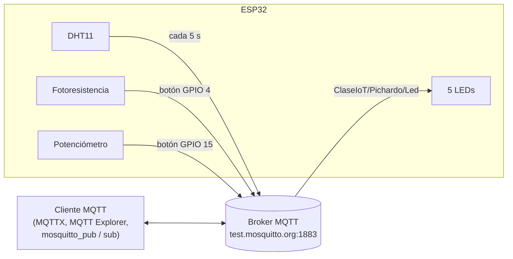

<div align="center">

# Proyecto 3: Comunicación MQTT con ESP32


El ESP32 actúa como **cliente MQTT**: publica lecturas de sensores en un broker y se suscribe a un tópico para recibir comandos que controlan cinco LEDs. MQTT es un protocolo ligero de publicación/suscripción, base de muchos sistemas IoT escalables y de la integración con dashboards y plataformas de automatización.

</div>

[← Volver al índice de proyectos](../../README.md)

---

## Qué hace

- **Publica el DHT11** (temperatura y humedad) automáticamente cada 5 segundos.
- **Publica la fotoresistencia o el potenciómetro** de forma manual, al presionar el botón correspondiente.
- **Recibe comandos** por MQTT para encender LEDs individuales, apagarlos todos o lanzar efectos de secuencia.
- Se reconecta automáticamente al WiFi y al broker gracias a la librería `EspMQTTClient`.

## Flujo de datos



## Tópicos MQTT

| Tópico | Sentido | Contenido |
|---|:-:|---|
| `ClaseIoT/Pichardo/Led` | ESP32 ← broker | Comando de control de LEDs (0 a 9) |
| `ClaseIoT/Pichardo/Fotoresistencia` | ESP32 → broker | Lectura del LDR (0–4095) al presionar el botón de GPIO 4 |
| `ClaseIoT/Pichardo/Potenciometro` | ESP32 → broker | Lectura del potenciómetro (0–4095) al presionar el botón de GPIO 15 |
| `ClaseIoT/Pichardo/DHT/Temperatura` | ESP32 → broker | Temperatura en °C, cada 5 s |
| `ClaseIoT/Pichardo/DHT/Humedad` | ESP32 → broker | Humedad relativa en %, cada 5 s |

### Comandos para los LEDs

| Mensaje | Efecto |
|:-:|---|
| `1` – `5` | Enciende el LED correspondiente |
| `0` | Apaga todos los LEDs |
| `6` | Enciende los LEDs impares (1, 3 y 5) |
| `7` | Enciende los LEDs pares (2 y 4) |
| `8` | Efecto "tren" ascendente: los LEDs se encienden en secuencia (800 ms entre cada uno) |
| `9` | Efecto "tren" descendente: los LEDs se apagan en secuencia del 5 al 1 |

## Componentes y conexiones

Usa el [mapa de pines compartido](../../media/PinMapEsp32IoT.jpg) del repositorio.

| Componente | Pin |
|---|:-:|
| LED 1 – 5 | GPIO 14, 27, 26, 25, 33 |
| Botón con pull-up interno (publica el LDR) | GPIO 4 |
| Botón con pull-down externo (publica el potenciómetro) | GPIO 15 |
| Fotoresistencia (LDR) | GPIO 34 |
| Potenciómetro | GPIO 35 |
| DHT11 | GPIO 32 |

## Cómo probarlo

**1. Librerías** (Gestor de bibliotecas del Arduino IDE):

- `EspMQTTClient` (instala también `PubSubClient`)
- `DHT sensor library` y `Adafruit Unified Sensor`

**2. Configuración.** En el sketch, ajusta los datos de tu red y del broker:

```cpp
const char* ssid       = "Nombre_red";
const char* password   = "Contraseña_red";
const char* broker     = "test.mosquitto.org";  // Broker público de prueba
const char* nameClient = "ESP32_name";          // Identificador único del cliente
```

**3. Carga el sketch**, abre el Monitor Serie a 115200 baudios y espera a que se conecte.

**4. Interactúa con el sistema** desde cualquier cliente MQTT. Por ejemplo, con las herramientas de línea de comandos de Mosquitto:

```bash
# Escuchar todo lo que publica el ESP32
mosquitto_sub -h test.mosquitto.org -t "ClaseIoT/Pichardo/#" -v

# Encender los LEDs impares
mosquitto_pub -h test.mosquitto.org -t "ClaseIoT/Pichardo/Led" -m "6"

# Lanzar el efecto tren ascendente
mosquitto_pub -h test.mosquitto.org -t "ClaseIoT/Pichardo/Led" -m "8"
```

<!-- Opcional: agregar aquí una captura del cliente MQTT (MQTTX / MQTT Explorer) mostrando los tópicos -->

## Limitaciones y mejoras posibles

- **Broker público sin autenticación:** `test.mosquitto.org` es ideal para pruebas, pero cualquiera que conozca los tópicos puede leer los datos o mandar comandos. Para un uso real conviene un broker propio con usuario, contraseña y TLS, y tópicos únicos.
- **Efectos bloqueantes:** los comandos `8` y `9` usan `delay()` dentro del callback, así que durante la secuencia el ESP32 no procesa otros eventos. Se podría reescribir con `millis()`.
- **Antirrebote compartido:** ambos botones usan el mismo temporizador; separarlos evitaría que uno bloquee al otro.
- **Datos sin persistencia:** las lecturas solo se publican; guardarlas en una base de datos permitiría analizar su historial.

## Autor

**Cristian Eduardo Pichardo Rico**

Egresado de la Licenciatura en Física, Facultad de Ciencias, UNAM
GitHub: [@Edvard-Pichardo](https://github.com/Edvard-Pichardo)

Distribuido bajo la licencia **MIT**. Consulta el archivo [LICENSE](../../LICENSE).

