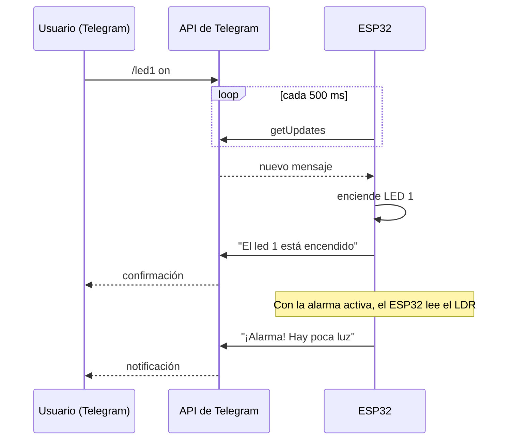

<div align="center">

# Proyecto 4: Control y Monitoreo con un Bot de Telegram


El ESP32 se convierte en un **bot de Telegram** que permite controlar y monitorear dispositivos desde cualquier lugar con solo enviar mensajes de texto. Incluye control de LEDs, lectura de un potenciómetro y un sistema de **alarma de luz** con umbral configurable.

</div>

[← Volver al índice de proyectos](../../README.md)

---

## Qué hace

- Enciende y apaga cinco LEDs individualmente.
- Devuelve la lectura del potenciómetro bajo demanda.
- Vigila el nivel de luz con una fotoresistencia y **envía una notificación automática** cuando cae por debajo de un umbral que el usuario puede ajustar.

## Cómo funciona



> El ESP32 consulta a Telegram cada 500 ms (*polling*) mediante HTTPS, por lo que no necesita una IP pública ni abrir puertos en el router.

## Comandos

| Comando | Descripción | Respuesta del bot |
|---|---|---|
| `/led1 on` … `/led5 on` | Enciende el LED indicado (1 a 5) | `El led N está encendido` |
| `/led1 off` … `/led5 off` | Apaga el LED indicado | `El led N está apagado` |
| `/pot` | Lee el potenciómetro | `El valor del potenciómetro es: <0–4095>` |
| `/rangoAlarma <0–4095>` | Fija el umbral de la alarma de luz (por defecto, 500) | `El umbral de la alarma fue ajustado a <valor>` |
| `/alarma on` | Activa la alarma | `Alarma activada` |
| `/alarma off` | Desactiva la alarma | `Alarma desactivada` |

> Si el comando es inválido, el bot lo indica: pide un LED entre 1 y 5, un estado `on`/`off`, o un valor entre 0 y 4095.

### Ejemplo de conversación

```text
Tú:  /led1 on
Bot: El led 1 está encendido

Tú:  /pot
Bot: El valor del potenciómetro es: 2048        (valor ilustrativo)

Tú:  /rangoAlarma 800
Bot: El umbral de la alarma fue ajustado a 800

Tú:  /alarma on
Bot: Alarma activada

     ...la luz baja del umbral...
Bot: ¡Alarma! Hay poca luz
```

## Componentes y conexiones

Usa el [mapa de pines compartido](../../media/PinMapEsp32IoT.jpg) del repositorio.

| Componente | Pin |
|---|:-:|
| LED 1 – 5 | GPIO 14, 27, 26, 25, 33 |
| Fotoresistencia (LDR) | GPIO 34 |
| Potenciómetro | GPIO 35 |

## Cómo probarlo

**1. Crea tu bot.** En Telegram, abre una conversación con [@BotFather](https://t.me/BotFather), envía `/newbot` y guarda el **token** que te entrega.

**2. Librerías** (Gestor de bibliotecas del Arduino IDE):

- `UniversalTelegramBot`
- `ArduinoJson` (dependencia de la anterior)

**3. Configuración.** Edita las credenciales en el sketch:

```cpp
const char* ssid     = "Nombre_red";
const char* password = "contraseña_red";
const char* botToken = "token_del_bot";   // Token de BotFather
```

**4. Carga el sketch**, abre el Monitor Serie a 115200 baudios y, una vez conectado a WiFi, escríbele a tu bot en Telegram.

> Envía primero cualquier comando al bot: así el ESP32 guarda tu chat y sabe a dónde mandar las notificaciones de la alarma.

## Limitaciones y mejoras posibles

- **Sin validación de usuario:** el bot responde a cualquier persona que lo encuentre en Telegram. Se puede restringir comparando el `chat_id` con uno autorizado, como hace el [sistema de seguridad con ESP32 y Telegram](https://github.com/Edvard-Pichardo/esp32-sistema-de-seguridad-para-una-habitacion) de este mismo autor.
- **Conexión sin verificar el certificado:** se usa `setInsecure()` por simplicidad. Cargar el certificado raíz de Telegram permitiría validar el servidor.
- **Alarma repetitiva:** mientras la luz esté bajo el umbral, se envía una notificación en cada ciclo. Una bandera o un tiempo de espera entre avisos evitaría saturar el chat y los límites de Telegram.
- **Formato del comando de LEDs:** el número va pegado al comando (`/led1 on`); un analizador de texto más flexible aceptaría también variantes como `/led 1 on`.

## Autor

**Cristian Eduardo Pichardo Rico**

Egresado de la Licenciatura en Física, Facultad de Ciencias, UNAM
GitHub: [@Edvard-Pichardo](https://github.com/Edvard-Pichardo)

Distribuido bajo la licencia **MIT**. Consulta el archivo [LICENSE](../../LICENSE).


