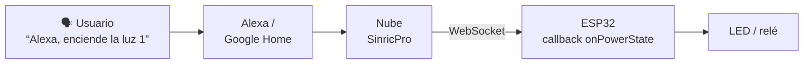

<div align="center">

# Proyecto 5: Control por Voz con SinricPro (Alexa / Google Home)


El ESP32 se integra con la plataforma en la nube **SinricPro** para que tres dispositivos (LEDs o relés) puedan controlarse con **comandos de voz** desde Alexa o Google Home. Cada dispositivo se registra en la nube con un ID único y se enlaza a una función *callback* que cambia el estado del pin al recibir una orden de encendido o apagado.

</div>

[← Volver al índice de proyectos](../../README.md)

---

## Qué hace

- Registra **tres interruptores** (*switches*) en SinricPro.
- Aplica al instante las órdenes de encendido y apagado sobre tres LEDs (o relés).
- Mantiene una conexión persistente por **WebSockets**, lo que da una respuesta rápida y confiable.
- Desactiva el modo de ahorro de energía del WiFi y activa la reconexión automática para no perder la conexión con la nube.

## Flujo de una orden de voz



1. El asistente de voz interpreta la orden y la envía a SinricPro.
2. SinricPro la reenvía al ESP32 por WebSocket.
3. El ESP32 ejecuta el *callback* del dispositivo correspondiente y cambia el estado del pin.

## Componentes y conexiones

Usa el [mapa de pines compartido](../../media/PinMapEsp32IoT.jpg) del repositorio.

| Dispositivo en SinricPro | Pin del ESP32 |
|---|:-:|
| Switch 1 (LED / relé 1) | GPIO 14 |
| Switch 2 (LED / relé 2) | GPIO 27 |
| Switch 3 (LED / relé 3) | GPIO 26 |

## Cómo probarlo

**1. Configura SinricPro.**

1. Crea una cuenta en [sinric.pro](https://sinric.pro/).
2. Crea **tres dispositivos de tipo *Switch***. El nombre que les des es el que dirás al asistente de voz (por ejemplo, "luz 1").
3. Copia tu `APP_KEY` y `APP_SECRET`, y el ID de cada dispositivo.
4. Vincula SinricPro con tu asistente: habilita la *skill* en Alexa o enlaza el servicio en Google Home, y descubre los dispositivos.

**2. Librería** (Gestor de bibliotecas del Arduino IDE): `SinricPro`, junto con sus dependencias (`ArduinoJson` y `WebSockets`).

**3. Configuración.** Edita las credenciales en el sketch:

```cpp
#define WIFI_SSID    "Nombre_red"
#define WIFI_PASS    "Clave_red"

#define APP_KEY      "App_key"
#define APP_SECRET   "App_secret"

#define SWITCH_ID_1  "id_1"
#define SWITCH_ID_2  "id_2"
#define SWITCH_ID_3  "id_3"
```

**4. Carga el sketch**, abre el Monitor Serie a 115200 baudios y verifica que aparezcan los mensajes de conexión a WiFi y a SinricPro.

**5. Pruébalo por voz o desde la app.** Por ejemplo: *"Alexa, enciende la luz 1"* (según el nombre que hayas asignado). También puedes accionar los interruptores desde el panel de SinricPro o su aplicación.


## Limitaciones y mejoras posibles

- **Sin reporte de estado:** el ESP32 solo recibe órdenes; no informa a la nube cuando el estado cambia por otro medio. Añadir botones físicos y reportar el estado mantendría sincronizada la app.
- **Solo interruptores:** SinricPro admite otros tipos de dispositivo, como atenuadores o sensores, con los que se podría controlar el brillo o publicar lecturas.
- **Credenciales en el código:** las claves están en `#define` dentro del sketch. Conviene mantenerlas fuera del repositorio (por ejemplo, en un archivo de configuración ignorado por Git).

## Autor

**Cristian Eduardo Pichardo Rico**
Egresado de la Licenciatura en Física, Facultad de Ciencias, UNAM
GitHub: [@Edvard-Pichardo](https://github.com/Edvard-Pichardo)

Distribuido bajo la licencia **MIT**. Consulta el archivo [LICENSE](../../LICENSE).
