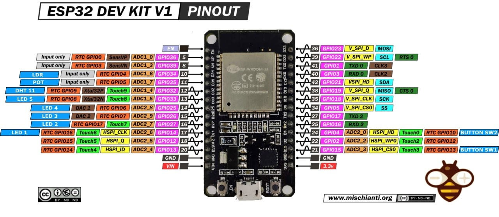

# Proyectos IoT - ESP32

## Descripción:

Este repositorio documenta el desarrollo de cinco sistemas IoT implementados con un microcontrolador ESP32 DevKit V1 como parte del curso Introducción al Internet de las Cosas. Cada proyecto explora un paradigma distinto de comunicación y control de dispositivos físicos.

## Hardware utilizado

- ESP32 DevKit V1

- Sensores digitales y analógicos

- Actuadores (LEDs, relés, buzzer)

## Proyectos incluidos

### 1. Control por Bluetooth

Comunicación directa entre dispositivo móvil y ESP32 para control de actuadores en tiempo real.

Sistema IoT basado en comunicación Bluetooth clásica (SPP) entre un dispositivo móvil y una placa ESP32 DevKit V1. El sistema permite controlar actuadores digitales y consultar variables ambientales medidas por un sensor DHT11 mediante comandos remotos.

El ESP32 opera como servidor Bluetooth, recibe comandos ASCII y responde con datos de temperatura y humedad cuando se activan entradas físicas.

### 2. Servidor Web Local (pendiente)

Implementación de un servidor HTTP embebido para monitoreo y control desde navegador.

### 3. Comunicación MQTT (pendiente)

Sistema de publicación/suscripción usando broker Mosquitto para intercambio de datos IoT.

### 4. Control mediante Bot de Telegram (pendiente)

Interfaz remota segura para control y monitoreo del sistema mediante mensajería.

### 5. Integración con SinricPro (pendiente)

Automatización IoT con servicios en la nube para control remoto de dispositivos.

## Tecnologías usadas 

- Arduino IDE

- ESP32

- WiFi

- MQTT

- HTTP

- APIs de mensajería

- Servicios cloud IoT
