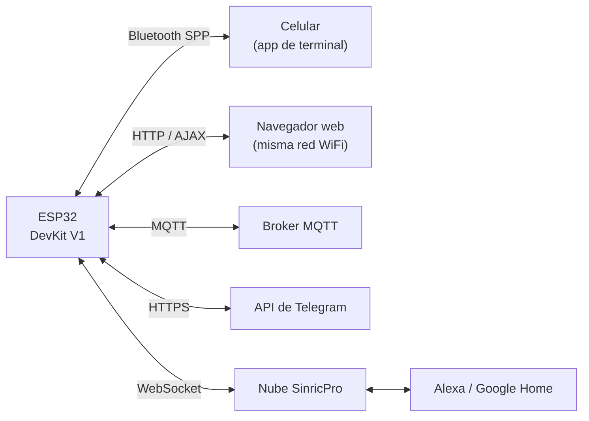

<div align="center">
  
# Proyectos IoT con ESP32


Colección de **cinco sistemas IoT** construidos con un ESP32 DevKit V1. Cada proyecto controla y monitorea el mismo circuito físico, pero con un **paradigma de comunicación distinto**: Bluetooth, servidor web, MQTT, mensajería con bot y asistentes de voz en la nube.

</div>

> Desarrollados en el curso *Introducción al Internet de las Cosas* (Seminario de Ciencias de la Computación A), Facultad de Ciencias, UNAM.

---

## Contenido

- [Proyectos incluidos](#-proyectos-incluidos)
- [Arquitectura general](#-arquitectura-general)
- [Hardware](#-hardware)
- [Cómo empezar](#-cómo-empezar)
- [Estructura del repositorio](#-estructura-del-repositorio)
- [Ideas futuras](#-ideas-futuras)
- [Autor y licencia](#-autor-y-licencia)

---

## Proyectos incluidos

| # | Proyecto | Comunicación | Qué hace |
|:-:|---|---|---|
| 1 | [Control por Bluetooth](Proyectos/01_bluetooth_control/) | Bluetooth clásico (SPP) | Enciende y apaga 5 LEDs con comandos desde una app de terminal y devuelve temperatura y humedad (DHT11) al presionar botones físicos |
| 2 | [Servidor Web Local](Proyectos/02_servidor_web/) | HTTP + AJAX (servidor asíncrono) | Página web con lecturas en vivo de un potenciómetro y una fotoresistencia, 3 LEDs con interruptor y 2 con control de brillo por PWM |
| 3 | [Comunicación MQTT](Proyectos/03_comunicacion_mqtt/) | MQTT (publicación/suscripción) | Publica datos de sensores en un broker y recibe comandos para controlar 5 LEDs, incluidos efectos de secuencia |
| 4 | [Bot de Telegram](Proyectos/04_Bot_telegram/) | HTTPS (API de Telegram) | Controla LEDs, lee el potenciómetro y envía una alarma cuando la luz cae por debajo de un umbral configurable |
| 5 | [Integración con SinricPro](Proyectos/05_Integracion_sinricpro/) | WebSockets (nube SinricPro) | Controla 3 LEDs por comandos de voz con Alexa o Google Home |

## Arquitectura general


```mermaid
flowchart LR
    ESP["ESP32<br/>DevKit V1"]

    ESP <-- "Bluetooth SPP" --> BT["Celular<br/>(app de terminal)"]
    ESP <-- "HTTP / AJAX" --> WEB["Navegador web<br/>(misma red WiFi)"]
    ESP <-- "MQTT" --> MQ["Broker MQTT"]
    ESP <-- "HTTPS" --> TG["API de Telegram"]
    ESP <-- "WebSocket" --> SI["Nube SinricPro"]
    SI <--> VOZ["Alexa / Google Home"]
```

## Hardware

<p align="center">
  
</p>

Los cinco proyectos comparten el **mismo circuito**: cada uno usa un subconjunto de los componentes con la misma asignación de pines. Así, un solo montaje sirve para probar todos.


| Componente | Pin | 1 | 2 | 3 | 4 | 5 |
|---|:-:|:-:|:-:|:-:|:-:|:-:|
| LED 1 | GPIO 14 | ✅ | ✅ | ✅ | ✅ | ✅ |
| LED 2 | GPIO 27 | ✅ | ✅ | ✅ | ✅ | ✅ |
| LED 3 | GPIO 26 | ✅ | ✅ | ✅ | ✅ | ✅ |
| LED 4 | GPIO 25 | ✅ | ✅ (PWM) | ✅ | ✅ | — |
| LED 5 | GPIO 33 | ✅ | ✅ (PWM) | ✅ | ✅ | — |
| Pulsador SW1 (pull-down externo) | GPIO 15 | ✅ | — | ✅ | — | — |
| Pulsador SW2 (pull-up) | GPIO 4 | ✅ | — | ✅ | — | — |
| Sensor DHT11 | GPIO 32 | ✅ | — | ✅ | — | — |
| Fotoresistencia (LDR) | GPIO 34 | — | ✅ | ✅ | ✅ | — |
| Potenciómetro | GPIO 35 | — | ✅ | ✅ | ✅ | — |

- Los LEDs llevan resistencias de 220 Ω a GND.
- En el proyecto 5 los tres LEDs pueden sustituirse por relés.

## Cómo empezar

1. Instala el [Arduino IDE](https://www.arduino.cc/en/software) y agrega el soporte para placas ESP32 (paquete **esp32** de Espressif, versión 3.x: el proyecto 2 usa `ledcAttachChannel`).
2. Arma el circuito con el mapa de pines de arriba.
3. Abre la carpeta del proyecto que quieras probar y consulta su README para ver las librerías y la configuración necesarias.
4. Edita las credenciales del sketch (WiFi, token, claves) y carga el programa a la placa ("ESP32 Dev Module").
5. Abre el Monitor Serie a **115200 baudios** para seguir los mensajes de depuración.

> Por seguridad, los sketches incluyen solo **valores de ejemplo** en lugar de credenciales.

```text
.
├── Proyectos/
│   ├── 01_bluetooth_control/
│   ├── 02_servidor_web/
│   ├── 03_comunicacion_mqtt/
│   ├── 04_Bot_telegram/
│   └── 05_Integracion_sinricpro/
├── media/                # Imágenes y mapa de pines
├── LICENSE
└── README.md
```

## Ideas futuras

- Unificar los cinco modos de control en un solo firmware.
- Guardar las lecturas publicadas por MQTT en una base de datos o un archivo CSV para analizarlas después (por ejemplo, con Python) y graficar su evolución.
- Un panel de visualización en tiempo real sobre el broker MQTT.
- Autenticación y cifrado en las comunicaciones (broker propio con usuario y TLS, validación del usuario en el bot).

## Autor y licencia

**Cristian Eduardo Pichardo Rico**

Egresado de la Licenciatura en Física, Facultad de Ciencias, UNAM

Linkedin: [Edvard Pichardo](https://www.linkedin.com/in/edvard-pichardo) · GitHub: [@Edvard-Pichardo](https://github.com/Edvard-Pichardo)

Distribuido bajo la licencia **MIT**. Consulta el archivo [LICENSE](LICENSE) para más información.


