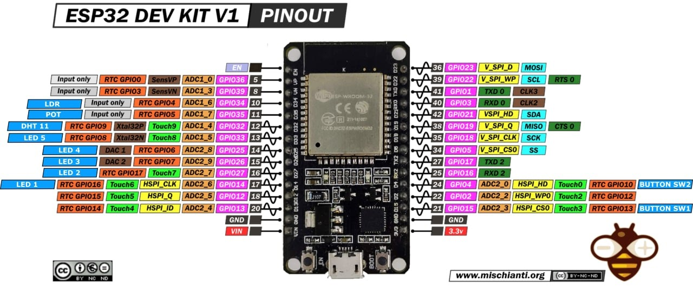

# Proyectos IoT - ESP32

    

## Descripción

Este repositorio documenta el desarrollo de cinco sistemas IoT implementados con un microcontrolador ESP32 DevKit V1 como parte del curso Introducción al Internet de las Cosas. Cada proyecto explora un paradigma distinto de comunicación y control de dispositivos físicos.

## Hardware utilizado

- ESP32 DevKit V1

- Sensores digitales y analógicos

- Actuadores (LEDs, relés, buzzer)

## Proyectos incluidos

### 1. Control por Bluetooth

**Comunicación inalámbrica para monitoreo y actuación remota.**

Este proyecto implementa un sistema de control y monitoreo utilizando un ESP32 como servidor Bluetooth clásico (SPP). A través de una aplicación de terminal Bluetooth en un dispositivo móvil, el usuario puede enviar comandos numéricos para encender o apagar individualmente cinco LEDs, así como recibir lecturas de temperatura y humedad de un sensor DHT11 al presionar botones físicos conectados al ESP32. La comunicación es bidireccional y en tiempo real, demostrando los fundamentos de la interacción inalámbrica en sistemas embebidos.

### 2. Servidor Web Local

**Interfaz gráfica desde el navegador para control y visualización.**

En este proyecto, el ESP32 actúa como un servidor web asíncrono que aloja una página web interactiva. Los usuarios conectados a la misma red WiFi pueden acceder a la interfaz para monitorear en tiempo real los valores de un potenciómetro y una fotoresistencia, así como controlar cinco LEDs: tres de ellos mediante interruptores de encendido/apagado y dos con control de brillo por PWM a través de deslizadores. La página web, construida con HTML, CSS y JavaScript, se comunica con el servidor mediante peticiones AJAX para actualizar los datos sin recargar la página. Este proyecto sienta las bases para aplicaciones de domótica y monitoreo remoto.

### 3. Comunicación MQTT

**Publicación y suscripción de datos mediante protocolo MQTT.**

Este proyecto implementa un cliente MQTT en el ESP32 que se conecta a un broker público (mosquitto) para publicar lecturas de sensores (fotoresistencia, potenciómetro y DHT11) y recibir comandos de control para cinco LEDs. Los botones físicos permiten publicar manualmente los valores de los sensores, mientras que el DHT11 envía automáticamente temperatura y humedad cada 5 segundos. El uso del protocolo MQTT, ligero y eficiente, sienta las bases para sistemas IoT escalables, integración con dashboards y plataformas de automatización.

### 4. Control mediante Bot de Telegram

**Gestión remota de dispositivos mediante mensajería instantánea.**

Este proyecto convierte al ESP32 en un bot de Telegram que permite controlar y monitorear dispositivos desde cualquier lugar a través de mensajes de texto. El sistema incluye cinco comandos principales: encender/apagar LEDs individualmente (`/led [1-5] on/off`), leer el valor del potenciómetro (`/pot`), configurar el umbral de una alarma de luz (`/rangoAlarma` [0-4095]) y activar/desactivar el sistema de alarma (`/alarma on/off`). Cuando la alarma está activada, el bot envía una notificación automática si el nivel de luz (medido por una fotoresistencia) cae por debajo del umbral establecido. 

### 5. Integración con SinricPro

**Integración con asistentes de voz para control de dispositivos.**

Este proyecto utiliza la plataforma SinricPro para conectar el ESP32 con Alexa o Google Home, permitiendo controlar tres LEDs (o relés) mediante comandos de voz. Cada dispositivo se registra en la nube de SinricPro con un ID único y se asocia a funciones callback que cambian el estado de los LEDs al recibir órdenes de encendido/apagado. La comunicación se realiza a través de WebSockets, garantizando una respuesta rápida y confiable. 

## Tecnologías usadas 

- Arduino IDE

- ESP32

- WiFi

- MQTT

- HTTP

- APIs de mensajería

- Servicios cloud IoT

## Licencia

Este proyecto está bajo la licencia MIT. Puedes ver el archivo LICENSE para más detalles.

# Autor

## Edvard Pichardo

**Licenciado en Física**  
Universidad Nacional Autónoma de México (UNAM)

